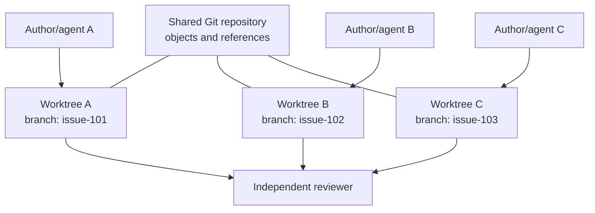

import { Aside } from '@astrojs/starlight/components'
import Disclaimer from '~/components/Disclaimer.astro'

## TL;DR

Let's keep it simple: instead of duplicating full clones or risking overlapping changes when running several AI agents in parallel, you can use **Git worktrees**. They give each agent an isolated directory and its own branch, all sharing a single local repository.

Here are the main commands you'll need:

```bash
# Create a new workspace and branch from origin/main
git worktree add -b <new-branch> <path-to-dir> origin/main

# List active worktrees
git worktree list

# Remove a worktree when the job is done
git worktree remove <path-to-dir>
```

## Why we need boundaries for AI agents

Running multiple coding agents simultaneously is extremely powerful, but throwing them all into the same working directory is a recipe for chaos. One agent switches branches while another is writing, built artifacts overwrite each other, and you lose track of who did what.

You _could_ clone the repository five times, but that duplicates gigabytes of history and requires configuring remotes repeatedly.

This is where **Git worktrees** are a lifesaver. Instead of duplicating the entire repository, a worktree lets you check out multiple branches into separate directories at the same time, all linked back to a single shared repository database. It's incredibly light and perfectly isolates each agent's environment!

{/* <!-- truncate --> */}

## The mental model: branch, worktree, agent

Let's break down the roles:

- **Branch**: The stream of work (history).
- **Worktree**: The physical folder where the files live, along with its own index and `HEAD`.
- **Agent**: The worker (human or AI) editing files inside that folder.



## Setting up the workspace

To give each agent a clean starting point, grab the latest commits and spin up a worktree for each task:

```bash
git fetch origin
BASE_COMMIT=$(git rev-parse origin/main)

# Add worktrees in a dedicated directory outside your main checkout
git worktree add -b issue-101 ../worktrees/issue-101 "$BASE_COMMIT"
git worktree add -b issue-102 ../worktrees/issue-102 "$BASE_COMMIT"
```

Pinning to a specific `$BASE_COMMIT` guarantees all agents start with the exact same codebase, even if someone pushes to `main` while your agents are running.

When dispatching an agent to a worktree, keep their scope tight. Give them:

1. A clear goal and acceptance criteria.
2. A list of files they are allowed to modify.
3. The specific tests they must run before handing over.

<Aside type="caution">
  Never check out the same branch in two different worktrees! Git blocks this by
  default to prevent workers from stepping on each other's toes, so don't try to
  force it. One task, one branch, one folder.
</Aside>

## Handling overlapping work (and reviews)

Even though worktrees isolate files from a build perspective, they can't prevent logical conflicts. If two agents work on the same module, they might make incompatible changes.

To save yourself debugging head-scratchers later:

- **Partition tasks upfront:** Assign agents to different files or modules whenever possible.
- **Review with a fresh eye:** Never let an agent merge its own code. Have an independent reviewer (or human) verify the logic against the original issue.

When the agent finishes, have them commit their changes cleanly:

```bash
git add src/feature.ts tests/feature.test.ts
git commit -m "feat: resolve issue 101"
```

Running formatting, linting, and testing directly inside that worktree ensures the branch is fully functional on its own before any integration begins.

## Fast PR reviews without the context switch

Worktrees aren't just for AI agents—they're super useful for humans too! Imagine you're deep in a complex feature, your working directory is messy with half-finished changes, and a colleague asks for an urgent review on their Pull Request.

Instead of stashing your work, resetting your files, or cloning the repo from scratch, you can simply spin up a temporary worktree to check out their branch:

```bash
git worktree add ../review-pr colleague-branch
```

Now you can test, run, and explore their PR in a separate folder without touching your own active workspace. When you're done, just delete that extra worktree and get right back to exactly where you left off. No lost progress, no stash conflicts, and zero friction!

## A Few Gotchas to Watch Out For

While worktrees are fantastic, running processes in parallel has some unique challenges:

- **Lockfiles & Shared Files**: Package files like `package.json` or `pnpm-lock.yaml` are common hot-spots. Avoid letting separate agents modify dependencies simultaneously.
- **Ports & Resources**: Worktrees isolate files, but not your operating system! If two agents try to spin up development servers, they will fight over the same port. Use different port configs or run them sequentially.
- **Environment Files**: Git-ignored files (like `.env`) aren't copied automatically to new worktrees. Make sure your setup scripts provision them correctly.
- **Stale Metadata**: Never delete a worktree folder manually! Always use `git worktree remove ../worktrees/issue-101` to let Git clean up its administrative metadata correctly. If you did delete one manually, run `git worktree prune` to sweep away the leftovers.

## Wrapping Up

Git worktrees turn parallel coding from a shared-directory scramble into a set of clean, isolated lanes.

Just remember: worktrees are fantastic for a handful of tasks on a trusted machine, but they won't solve communication overhead. If your agents are all redesigning the same core database, you'll still need to coordinate their plans first!

Give worktrees a try on your next multi-agent project—your filesystem will thank you!

## References

- [Git worktree documentation](https://git-scm.com/docs/git-worktree)
- [Git branch documentation](https://git-scm.com/docs/git-branch)
- [Git merge documentation](https://git-scm.com/docs/git-merge)

<Disclaimer />
