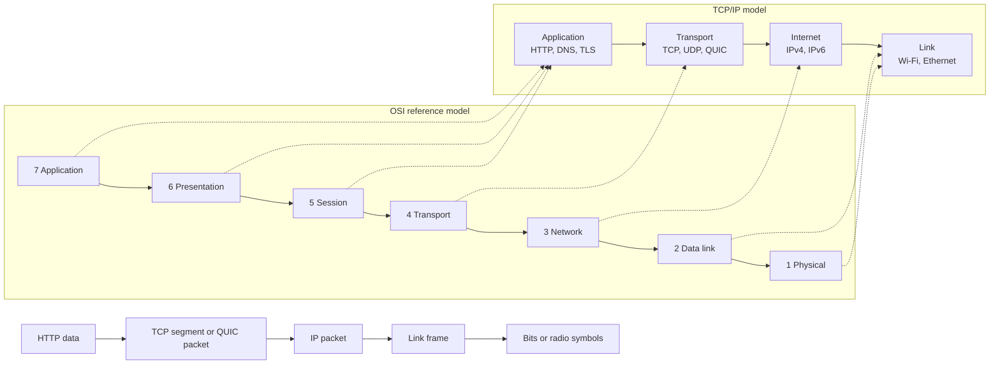
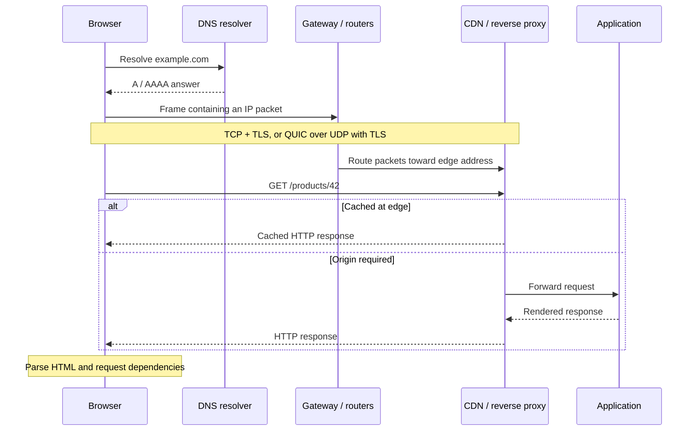

import { Aside } from '@astrojs/starlight/components'
import Disclaimer from '~/components/Disclaimer.astro'

## TL;DR

Loading a web page isn't just a single event; it's a beautifully coordinated dance across the globe. From DNS lookup and local networks to routing, TLS security, and HTTP requests, your browser runs a complex relay race in milliseconds. While layer models (like OSI and TCP/IP) help us understand this journey, real-world protocols are dynamic and don't always fit into perfect, tidy boxes.

## One Click, Many Conversations

Imagine typing `https://example.com/products/42` into your browser and hitting Enter. A second later, the page loads. It feels like a direct, simple conversation between your computer and a server. But that's a bit like saying, "I flew to Paris." It's true in spirit, but it completely skips check-in, security checks, baggage handling, air traffic control, and the suspiciously expensive airport sandwich.

To truly understand how the web works, let's follow that single request from your keyboard, across the physical world, to the application, and back. Along the way, we'll navigate using the two maps developers use most: the **Open Systems Interconnection (OSI)** model (a seven-layer reference guide that gives us a shared language) and the **Transmission Control Protocol/Internet Protocol (TCP/IP)** model (the actual, practical four-layer engine of the internet).

{/* <!-- truncate --> */}

## First, the Map

To keep things organized, networking models split the massive job of communication into bite-sized responsibilities. Your web browser shouldn't have to care whether you're using Wi-Fi, Ethernet, or a 5G connection. Similarly, the physical wires don't need to know if they're carrying a funny cat image or a secure payment request. Each layer focuses on its own task, trusting the layer below to do the heavy lifting and serving the layer above.



Let's look at how our two mental maps connect in this diagram:

1. **OSI Model (The Theoretical Map):** On the left, the classic 7-layer OSI model serves as our academic dictionary. It defines everything from raw physical signals (Layer 1) all the way up to user-facing applications (Layer 7).
2. **TCP/IP Model (The Working Engine):** In the middle, the four-layer TCP/IP model is what the internet actually runs on. It groups the top three OSI layers into a single focus—the **Application**—and combines the bottom layers into a unified **Link** layer.
3. **Encapsulation (The Matryoshka Doll):** The bottom flow shows the magic of how data travels. It's like nesting Russian Matryoshka dolls. Your browser's **Hypertext Transfer Protocol (HTTP)** data is wrapped in a **Transmission Control Protocol (TCP)** segment or **Quick UDP Internet Connections (QUIC)** packet (Transport), which gets tucked inside an **Internet Protocol (IP)** packet (Internet/Network), which is packaged into a **Link frame** (Data link), and finally converted into **Bits or radio symbols** (Physical) to fly through the air or zip down a wire.

When the receiving server gets your message, it does the exact opposite: it unwraps each layer one by one until it has the raw HTTP request.

<Aside type="caution">
  Remember that these are conceptual helpers, not rigid laws of physics.
  Implementations optimize and merge layers, hardware offloads tasks, and modern
  protocols often run across traditional boundaries. Use these models to help
  you trace issues and talk to teammates, not to win theoretical arguments about
  where a protocol "belongs."
</Aside>

## Stage 1: The Browser Decodes the URL

First, your browser [breaks down the **Uniform Resource Locator (URL)**](https://developer.mozilla.org/en-US/docs/Learn_web_development/Howto/Web_mechanics/What_is_a_URL#basics_anatomy_of_a_url) like a puzzle: the scheme (`https`), the host (`example.com`), and the path (`/products/42`). The `https` scheme tells the browser to prepare for **Hypertext Transfer Protocol Secure (HTTPS)** and listen on port `443`.

Before doing any heavy lifting, though, the browser performs a quick self-check. It asks: _Have I visited this site recently?_ If the answer is in its local cache, or if an active service worker is ready, your browser can skip the entire trip and display the page immediately. But today, we're assuming a "cold start." We need a fresh lookup.

## Stage 2: DNS Asks for Directions

Computers don't speak human language; they deal in IP addresses. To map `example.com` to an actual server IP, the browser consults the **Domain Name System (DNS)**—essentially the phone book of the internet.

Your machine looks at its local caches first. If it's a miss, a local **stub resolver** (a minimal DNS client on your local device that forwards namespace queries) asks a **recursive resolver** (the server, usually run by your **Internet Service Provider (ISP)**, your company, or a public service like Cloudflare or Google, that queries other servers to locate and return the correct IP address). If that resolver doesn't have the IP on hand, it politely asks root servers, who point to `.com` name servers, who finally direct us to the **authoritative servers** for `example.com` (the final servers in the lookup chain that hold the actual, definitive IP records).

In the blink of an eye, the resolver fetches the record—such as an **Internet Protocol version 4 (IPv4)** **`A` record** (the DNS database entry mapping a domain name to an IPv4 address) or an **Internet Protocol version 6 (IPv6)** **`AAAA` record** (mapping a domain name to an IPv6 address)—along with a **Time to Live (TTL)** telling us how long we're allowed to cache it. Traditionally, DNS runs over speedy, lightweight **User Datagram Protocol (UDP)**, though secure alternates like DNS over HTTPS are becoming common. To keep things fast, a **Content Delivery Network (CDN)**—a geographically distributed network of proxy servers that cache website content physically closer to users to improve loading times—will often return an IP address for an edge server located physically close to you, rather than the primary backend origin.

## Stage 3: Your device Jumps to the Local Gateway

Let's assume our DNS lookup gave us the address `203.0.113.20`. Your device's operating system checks its routing tables and realizes this address isn't on your home or office local network. To get outside, your device has to send the request to its "default gateway"—the local router interface that allows computers on a private network to communicate with external networks like the internet.

But before your device can wrap the Internet Protocol (IP) packet in a physical Wi-Fi or Ethernet frame, it needs to find the router's physical **Media Access Control (MAC)** address (the link-layer address). If you're on IPv4, it broadcasts an [Address Resolution Protocol (ARP)](https://www.rfc-editor.org/rfc/rfc826) request: _"Who has this IP address?"_ (ARP is a protocol used to map a known local IP address to a physical MAC address). On IPv6, it uses [Neighbor Discovery](https://www.rfc-editor.org/rfc/rfc4861) (the IPv6 network protocol that replaces ARP to handle local physical address resolution and local router discovery). Once it gets the physical address (which is almost always instantly cached), your network chip converts the digital frame into radio symbols or light pulses, sending it flying across your living room to your router.

## Stage 4: Routers Play Postal Service Across the Web

Your home router strips away your local frame wrapper, looks at the destination IP header, and consults its routing table to pass the packet to the next "hop" in the chain. This process repeats over and over across many internet exchanges and backbones.

Think of routers like postal workers passing your envelope from office to office. No single router plans the entire route from start to finish. Instead, they just know the next logical direction to send it.

The Internet Protocol (IP) only promises **best-effort delivery**. Packets can get lost, delayed, or arrive out of order, and IP won't step in to fix it. If you're on an older IPv4 network, your router will also run **Network Address Translation (NAT)**—a technique that maps multiple private IP addresses on your local network to a single public IP address when communicating with the internet—to swap your private home IP with its single public IP address. Modern [IPv6](https://www.rfc-editor.org/rfc/rfc8200) improves on this by giving every machine a unique, public address directly.

## Stage 5: Transport Establishes a Conversation

Since IP is unreliable best-effort delivery, we need a helper on top to make sure our data actually arrives intact. This is the job of the **Transport Layer**.

For traditional HTTP/1.1 or HTTP/2, your browser uses **Transmission Control Protocol (TCP)**. It begins with a friendly "three-way handshake" (`SYN` [Synchronize] -> `SYN-ACK` [Synchronize-Acknowledgment] -> `ACK` [Acknowledgment]) to synchronize. TCP gives us an ordered, reliable connection: if a packet goes missing, TCP notices and automatically asks for a retransmission, keeping the data stream perfectly clean and ordered.

However, modern HTTP/3 takes a smarter shortcut. It uses **Quick UDP Internet Connections (QUIC)** running over UDP. While raw UDP is notoriously "fire-and-forget," QUIC builds its own modern reliability and security layer on top. This avoids TCP's **head-of-line blocking**—a network performance issue where a single delayed or lost packet in a queue blocks all subsequent packets from processing. QUIC allows multiple parallel resource streams to download completely independently, and even handles switching from Wi-Fi to cellular smoothly.

## Stage 6: TLS Secures Your Handshake

We can't just send our data in the clear. Before any actual HTTP data is sent in our secure `https` request, your browser and the server perform the **Transport Layer Security (TLS)** handshake.

The server shows your browser its cryptographic certificate. Your browser inspects it: _Does this match the domain name? Has it expired? Is it signed by a trusted **Certificate Authority** (a trusted third-party organization that certifies the identity of websites and issues their digital cryptographic certificates)?_ Once trust is verified, they perform a cryptographic dance to create **session keys** (temporary cryptographic keys generated dynamically and used to securely encrypt and decrypt all communication for that specific session). Every message sent afterward is strongly encrypted, safe from anyone snooping on your router or ISP.

Where does TLS live in our dry 7-layer OSI model? While some place it under Presentation or Session, the real web treats it as part of the Application stack. In fact, QUIC actually embeds TLS directly into the transport handshake itself to save precious milliseconds.

## Stage 7: HTTP Expresses the Request

Now that we have a secure, reliable tube to the host, your browser finally sends the actual message: the HTTP request.

```http
GET /products/42 HTTP/1.1
Host: example.com
Accept: text/html
```

Behind the scenes, modern protocols like HTTP/2 and HTTP/3 compress headers and
convert them into binary streams to move lightning-fast, but conceptually, they
still express this exact, simple intent: _"Please give me the product page."_
They also send along metadata like cookies, preferred languages, compression
options, and caching validators like `ETag`
([Entity Tag](https://developer.mozilla.org/en-US/docs/Web/HTTP/Reference/Headers/ETag)—a unique identifier assigned by a web server to a specific version of a resource, used by browsers to check if cached content remains fresh) to
see if a cache is still fresh.

## Stage 8: Your Request is Received, Handled, and Answered

The IP address we chose doesn't usually point to a single computer under a desk. It usually hits a CDN edge server, a **load balancer** (a specialized proxy that distributes incoming network traffic across multiple backend servers to prevent overload and ensure high availability), or a **reverse proxy** (an intermediary server that receives incoming requests from the public internet and routes them to internal web servers).

This outer layer does some quick filtering: it validates the TLS handshake, rejects bad players, and checks if it already has a cached copy of the product page. If it's cached, the edge server sends it back immediately—saving a trip to the main servers.

If it's a cache miss, the load balancer forwards the request to your actual
application server. Your web framework matches `/products/42` to a handler
function. This handler might check if you're logged in, query a database,
compile a HTML template, and finally hand back an HTTP response—hopefully `200
OK`.

Let's look at the flow of this complete timeline:



As traced in the diagram above:

1. **Getting Directions:** Before sending data, your **Browser** reaches out to the **DNS resolver** to quickly resolve `example.com` to its IP coordinates.
2. **Opening a Secure Tunnel:** Your packets travel through your **Gateway** across the internet. An encrypted session (TCP/TLS or QUIC) is established between the browser and the nearby **CDN edge server**.
3. **Deciding the Content Path:** The browser fires its HTTP `GET` request. If the CDN has a cached copy on hand, it drops it straight back to the browser. Otherwise, the edge server tunnels the request directly to the backend **Application**, which renders the payload fresh from the database and returns it back down the pipeline.
4. **Bringing the Page to Life:** Your browser decodes the HTTP response, parses the HTML, and discovers other files it needs (CSS, JS, images). To fetch those, the entire cycle begins again, but this time, it reuses the connections we just warmed up!

## Debugging the Journey Layer by Layer

The next time a website doesn't load, "the internet is broken" isn't a very helpful diagnosis. Knowing these layers gives you a superpower: you can isolate where the chain is breaking by testing from the bottom up:

1. **Link Layer (Physical):** Are you actually connected to Wi-Fi or Ethernet? Did your device get an IP address from your gateway router?
2. **DNS (Name Resolution):** Can you resolve the host? Try running `dig example.com` or `nslookup` in the terminal to see if you can fetch an IP.
3. **Network Routing:** Is your computer able to reach the host geographically? Command line utilities like `traceroute` or `ping` can check if packets get dropped along the way.
4. **Transport Layer:** Are TCP handshakes completing? Is a strict firewall blocking UDP ports, preventing modern HTTP/3 and forcing a fallback to HTTP/2?
5. **TLS (Security):** Does your browser throw a certificate error? Is your system clock out of sync (which breaks cryptographic calculations)?
6. **HTTP (Protocol):** Pop open your browser's Developer Tools network tab. Are we receiving cached responses, or are redirects looping endlessly?
7. **Application Layer:** Are your microservices running? Check the server logs, trace database query times, and verify the backend isn't throwing errors on a database timeout.

Remember, latency piles up across all these layers too. Shaving a few bytes of JavaScript code can feel great, but caching your DNS records, using TLS session resumption, or serving static files from a close-by CDN edge will often win you much more speed.

## What the Layers Buy Us

Why did we build this complicated cake? By separating jobs into layers, we limit how much any single tool has to know. A browser can write HTTP without caring if you're on a fiber optic line or 5G. IP can route packets without knowing if they contain a transaction or a text message. A server can upgrade from HTTP/2 to HTTP/3 without having to adapt any application routing code. This keeps systems flexible and failures isolated.

Of course, these abstractions are "leaky." Big files may get broken up by path **MTU limits** (Maximum Transmission Unit—the size limit, in bytes, of the largest single packet or frame that can be transmitted across a given physical network interface). Heavy cell network traffic causes TCP packet loss, which degrades application latency. Real-world performance requires us to look across the boundaries rather than pretending they are perfect, sealed rooms.

## Conclusion

Every time you click a link, your computer coordinates a symphonic global conversation of naming, routing, encryption, protocol framing, and application server logic. These models aren't rigid physics rules—they are simply maps to help us build, debug, and understand the vast territory of the internet.

Keep your mental boxes flexible!

## References

- [Julia Evans' Wizard Zines on Networking](https://wizardzines.com/comics) — Delightfully illustrated, bite-sized comics explaining DNS, packets, and network routing in simple terms.
- [MDN: How the web works](https://developer.mozilla.org/en-US/docs/Learn_web_development/Getting_started/Web_standards/How_the_web_works) — A developer-centric introduction to browsers, servers, packets, and response pipelines.
- [MDN: Anatomy of a URL](https://developer.mozilla.org/en-US/docs/Learn_web_development/Howto/Web_mechanics/What_is_a_URL#basics_anatomy_of_a_url) — Master how hosts, paths, search params, and hashes are grouped together.

<Disclaimer />
