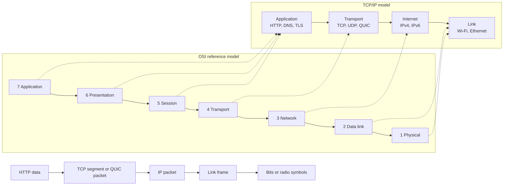
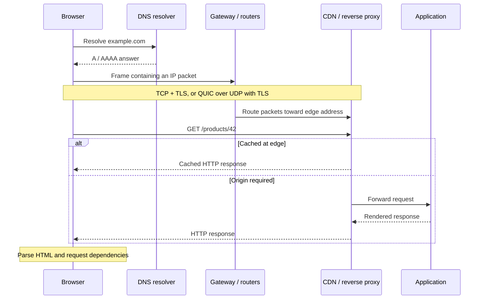

import { Aside } from '@astrojs/starlight/components'
import Disclaimer from '~/components/Disclaimer.astro'

## TL;DR

Loading a web page is not one operation. The browser discovers an address,
reaches the next hop on a local network, routes packets across networks,
establishes a secure connection, sends an HTTP request, and waits while several
servers produce a response. Layer models give us a useful vocabulary for those
jobs, but they are maps, not the territory: real protocols such as TLS and QUIC
do not always fit into one tidy box.

## One Click, Many Conversations

Imagine entering `https://example.com/products/42` and pressing Enter. A moment
later, a product page appears. It feels like the browser asked a server for a
document and the server sent it back. That summary is true in roughly the same
way that “I flew to Paris” is true: it skips check-in, security, boarding,
navigation, air-traffic control, and the suspiciously expensive sandwich.

We will follow that one request from the laptop to the application and back.
Along the way, we will use the two layer models developers encounter most often:
TCP/IP, which describes the Internet protocol suite, and OSI, a seven-layer
reference model that gives networking conversations a shared vocabulary.

{/* <!-- truncate --> */}

## First, the Map

The models divide communication by responsibility. An application should not
need to know whether the first physical hop uses Wi-Fi, Ethernet, or fiber. IP
should not need to understand whether its payload is an image or a payment
request. Each layer uses the service below it and offers a service above it.



The arrows on the right show **encapsulation**. HTTP data becomes transport
payload; that becomes IP payload; the IP packet becomes a frame on each local
link; the frame is represented as electrical, optical, or radio signals. The
receiver removes those wrappers in reverse.

<Aside type="caution">
  These are conceptual boundaries, not a literal tour through seven independent
  boxes. Implementations combine layers, hardware offloads work, and protocols
  cross boundaries. Use the models to reason and communicate, not to win an
  argument about where TLS “really” lives.
</Aside>

## Stage 1: The Browser Understands the URL

The browser parses the URL into a scheme (`https`), host (`example.com`), and
path (`/products/42`). The scheme implies secure HTTP and usually port `443`.
Before sending anything, the browser may consult its HTTP cache, service worker,
security policy, connection pool, or an existing connection. A warm navigation
can therefore skip much of the journey described below.

Assume this is a cold start. The browser needs an IP address for `example.com`.

## Stage 2: DNS Finds an Address

The Domain Name System is a distributed database. The browser and operating
system first inspect local caches. On a miss, a **stub resolver** asks a
recursive resolver, commonly provided by the network, an organization, or a
public DNS service. That resolver may already know the answer. Otherwise, it
walks the DNS hierarchy: root servers point to the `.com` name servers, which
point to the authoritative servers for `example.com`.

The answer can include an IPv4 `A` record, an IPv6 `AAAA` record, aliases, and a
time to live that controls caching. DNS traditionally uses UDP and falls back to
TCP in some cases; encrypted DNS transports such as DNS over HTTPS change the
transport without changing DNS's job. The protocol itself is defined across the
[DNS concepts and facilities](https://www.rfc-editor.org/rfc/rfc1034) and
[implementation specification](https://www.rfc-editor.org/rfc/rfc1035).

DNS selects an address, not necessarily the origin machine. A content delivery
network (CDN) may deliberately return an edge address near the user.

## Stage 3: The Laptop Reaches Its Next Hop

Suppose DNS returns `203.0.113.20`. The operating system compares that
destination with its routes. Because the address is outside the local subnet,
the next hop is normally the default gateway: the home router or an enterprise
gateway.

To put an IP packet into a local Ethernet or Wi-Fi frame, the laptop needs the
gateway's link-layer address. IPv4 networks use the
[Address Resolution Protocol (ARP)](https://www.rfc-editor.org/rfc/rfc826): in
effect, “Who has this IPv4 address?” IPv6 uses
[Neighbor Discovery](https://www.rfc-editor.org/rfc/rfc4861), built on ICMPv6.
Cached neighbor entries often make this exchange invisible.

The network interface encodes the frame into signals. Wi-Fi sends radio symbols
to an access point; Ethernet sends electrical or optical signals over a link.
The physical and link layers move a frame only across the current link. They do
not carry one unchanged Ethernet frame all the way to the website.

## Stage 4: IP Routes Packets Between Networks

The gateway removes the local frame, examines the destination IP address, and
forwards the packet according to its routing table. Each router repeats that
decision. The link-layer wrapper changes at every hop, while the IP destination
normally remains the same.

IP offers **best-effort datagram delivery**. Packets may be dropped, duplicated,
or reordered; IP does not promise arrival. IPv4 and IPv6 supply addressing and
routing, while transport protocols decide what reliability the application
needs. IPv6 is standardized in [RFC 8200](https://www.rfc-editor.org/rfc/rfc8200).

On a typical IPv4 home network, the gateway also performs Network Address
Translation (NAT), replacing the laptop's private source address and port with a
public mapping. NAT conserves public addresses but adds state and makes inbound
connectivity harder. IPv6 generally restores globally unique addressing,
although firewalls still control which traffic may enter.

No router plans the complete path like a navigation system. Routing protocols help networks
exchange reachability, and each router chooses a next hop. The outward and return
paths can differ.

## Stage 5: Transport Creates a Conversation

For HTTP/1.1 or HTTP/2, the browser usually opens a **TCP** connection. TCP's
three-way handshake exchanges `SYN`, `SYN-ACK`, and `ACK`. TCP then presents an
ordered, reliable byte stream: it detects loss, retransmits data, reorders
segments, controls the sending rate, and distinguishes conversations with port
numbers. The current TCP specification is
[RFC 9293](https://www.rfc-editor.org/rfc/rfc9293).

HTTP/3 takes another route. It uses **QUIC**, which runs over UDP. UDP itself is
a deliberately small datagram protocol with ports and a checksum, but no
delivery or ordering guarantee. QUIC builds secure connections, reliability,
congestion control, and multiple independent streams above it. Losing data on
one stream need not stall every other stream, avoiding TCP's connection-wide
head-of-line blocking for multiplexed HTTP requests. QUIC also reduces setup
round trips and supports connection migration when a device changes networks.

So “TCP is reliable; UDP is unreliable” is only half a mental model. An
application protocol can add reliability over UDP. QUIC does exactly that, as
specified by [RFC 9000](https://www.rfc-editor.org/rfc/rfc9000).

## Stage 6: TLS Establishes Trust and Encryption

Before ordinary HTTP data travels, TLS authenticates the server and negotiates
cryptographic keys. The server presents a certificate binding its identity to a
public key. The browser validates the hostname, validity period, signatures,
and chain to a trusted certificate authority. The peers agree on algorithms and
derive short-lived session keys; later records are encrypted and protected
against tampering.

TLS 1.3 is defined by [RFC 8446](https://www.rfc-editor.org/rfc/rfc8446). It
also negotiates an application protocol with ALPN, allowing the peers to choose
HTTP/2, for example. Session resumption can shorten repeat connections.

Where does TLS belong? The OSI presentation/session area is a convenient answer,
but the Internet stack commonly treats it as part of the application stack,
above TCP. QUIC makes the boundary blurrier because it incorporates the TLS 1.3
handshake while protecting QUIC transport data. The useful fact is what TLS
provides—identity, confidentiality, and integrity—not the color of its box.

## Stage 7: HTTP Expresses the Request

Now the browser can express application intent:

```http
GET /products/42 HTTP/1.1
Host: example.com
Accept: text/html
```

HTTP defines methods, status codes, fields, caching, and representation
semantics. HTTP/1.1 serializes textual messages; HTTP/2 and HTTP/3 use binary
framing and multiplex streams, but a `GET` still means the same thing. The core
semantics are specified in
[RFC 9110](https://www.rfc-editor.org/rfc/rfc9110), and
[MDN's HTTP overview](https://developer.mozilla.org/en-US/docs/Web/HTTP/Guides/Overview)
provides a friendly introduction.

Headers may carry cookies, accepted formats, conditional cache validators, and
compression preferences. With a fresh cache entry, no network request is
needed. With an `ETag`, the browser can ask whether its copy is still valid and
receive `304 Not Modified` instead of the full representation.

## Stage 8: The Edge and Application Answer

The IP address often terminates at a CDN edge, load balancer, or reverse proxy,
not at application code. That first server may terminate TLS, reject malicious
traffic, redirect HTTP to HTTPS, serve a cached response, compress content, or
forward the request to another region.

On a cache miss, a load balancer selects a healthy origin. A web server or
application framework routes `/products/42` to a handler. The handler may check
authorization, query a database, call other services, render HTML, and return a
response such as `200 OK`, `404 Not Found`, or `500 Internal Server Error`.
Those internal calls repeat parts of the same story on a data-center network.

The response flows back through HTTP, TLS/QUIC, transport, IP, and each local
link. The browser decrypts it, applies HTTP caching rules, parses the HTML, and
discovers stylesheets, scripts, fonts, and images. Each dependency may trigger
another request, although connection reuse, multiplexing, caches, and service
workers prevent every resource from starting from zero.



## Debugging the Journey Layer by Layer

When a page fails, “the Internet is broken” is not yet a diagnosis. Test the
journey from the bottom upward:

1. **Link:** Is Wi-Fi associated? Does the interface have an address and a
   default route? Can it reach the gateway?
2. **Name resolution:** Does the hostname resolve? Compare the system resolver
   with a known resolver and inspect record type, answer, and time to live.
3. **Routing:** Does traffic reach the destination network? Packet traces and
   route diagnostics can reveal loss, but silent routers do not necessarily
   mean the path is broken.
4. **Transport:** Can the client reach port `443`? Is a firewall blocking UDP,
   causing HTTP/3 to fall back to TCP-based HTTP/2?
5. **TLS:** Does the certificate match the hostname? Is the clock correct? Did
   protocol or cipher negotiation fail?
6. **HTTP:** Inspect the status, redirects, headers, cache behavior, and timing
   phases in browser developer tools.
7. **Application:** Correlate request IDs across the edge, server logs, traces,
   dependencies, and database. A fast network cannot rescue a slow query.

Latency also accumulates across layers. DNS lookup, connection setup, TLS,
round-trip time, edge-to-origin travel, and application work all contribute to
time to first byte. Reusing connections, caching near users, and avoiding
unnecessary round trips often matter more than shaving a few bytes from a
header.

## What the Layers Buy Us

Layering limits how much each component must understand. A browser can use HTTP
over Wi-Fi or Ethernet. IP can carry TCP or UDP. An application can move from
HTTP/2 to HTTP/3 without changing the meaning of its routes. This separation
enables independent evolution and makes failures easier to localize.

The abstraction is intentionally leaky. Path maximum transmission units affect
transport packet sizes. Congestion control affects application latency. TLS
exposes some metadata while encrypting other data. CDNs combine networking,
security, caching, and application behavior. Performance work often requires
looking across layers rather than pretending they are sealed compartments.

## Conclusion

One browser navigation coordinates naming, local delivery, global routing,
transport, cryptography, HTTP, edge infrastructure, and application code. The
TCP/IP and OSI models turn that complexity into manageable responsibilities.
Remember the sequence, but keep the boxes flexible: they explain the Internet;
they are not the Internet.

## References

- [MDN: How the web works](https://developer.mozilla.org/en-US/docs/Learn_web_development/Getting_started/Web_standards/How_the_web_works)
- [RFC 1034: Domain Names—Concepts and Facilities](https://www.rfc-editor.org/rfc/rfc1034)
- [RFC 8200: Internet Protocol, Version 6](https://www.rfc-editor.org/rfc/rfc8200)
- [RFC 9293: Transmission Control Protocol](https://www.rfc-editor.org/rfc/rfc9293)
- [RFC 9000: QUIC—A UDP-Based Multiplexed and Secure Transport](https://www.rfc-editor.org/rfc/rfc9000)
- [RFC 8446: The Transport Layer Security Protocol Version 1.3](https://www.rfc-editor.org/rfc/rfc8446)
- [RFC 9110: HTTP Semantics](https://www.rfc-editor.org/rfc/rfc9110)

<Disclaimer />
