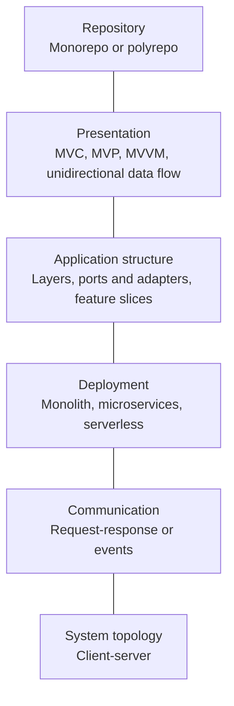

import { Aside } from '@astrojs/starlight/components'
import Disclaimer from '~/components/Disclaimer.astro'

## TL;DR

Software architecture is not one choice between a monolith, microservices,
Model-View-Presenter (MVP), or a monorepo. Those terms answer different
questions at different levels. A web application can use client-server
topology, deploy a modular monolith, organize its frontend with Feature-Sliced
Design, and keep everything in a monorepo at the same time. Good architecture
starts by identifying which question you are trying to answer.

## Introduction

Architecture discussions often sound like restaurant orders: _Should we choose
microservices, serverless, or a monorepo?_ The problem is that these options are
not all on the same menu. Microservices describe deployable units, serverless
describes an operational model, and a monorepo describes where source code
lives.

Architecture is better understood as a stack of related decisions. Each
decision creates boundaries, makes some changes easier, and makes others more
expensive. No architecture wins everywhere; it can only fit a particular
system, team, and set of constraints.

{/* <!-- truncate --> */}

## The Architecture Map

The same web application can be described at several levels:

These levels influence one another, but none completely determines the next.
For example, a monorepo can contain one monolith, many microservices, several
frontend applications, or all of them together.

| Level                 | The question it answers                    | Common choices                                        |
| --------------------- | ------------------------------------------ | ----------------------------------------------------- |
| System topology       | Where does work happen?                    | Client-server, peer-to-peer                           |
| Deployment            | What must be released and scaled together? | Monolith, modular monolith, microservices, serverless |
| Communication         | How do running components coordinate?      | Request-response, messaging, events                   |
| Application structure | How are dependencies and features divided? | Layers, ports and adapters, vertical slices           |
| Presentation          | How is UI behavior separated from the UI?  | MVC, MVP, MVVM, unidirectional data flow              |
| Repository            | Where are projects versioned?              | Monorepo, polyrepo                                    |

## 1. System Topology: Client-Server

Most web applications begin with **client-server architecture**. A client such
as a browser requests a resource or operation, and a server responds. The
browser might render a page, call an API, or maintain a WebSocket connection,
but the responsibility remains divided between a service consumer and a service
provider.

Client-server explains the relationship across the network. It does not tell us
whether the server is a monolith or fifty services, whether the frontend uses
MVP, or whether the code lives in one repository. For the network journey behind
that relationship, see [How the Internet Works, Layer by Layer](/learning-curve/blog/30-internet-layers).

## 2. Deployment: What Changes Together?

A **deployment boundary** determines which parts of the system must be released,
scaled, and recovered as a unit.

### Monolith

A monolith is an application deployed as one unit. This is often the simplest
way to develop, test, deploy, and observe a new product. A monolith can still
contain well-designed modules and layers; "one deployment" does not mean "one
large ball of code."

### Modular Monolith

A modular monolith keeps one deployment while enforcing boundaries between
business capabilities such as catalog, checkout, and billing. Modules
communicate through explicit interfaces instead of reaching into one another's
internals.

This is a strong default for many applications: it preserves the operational
simplicity of a monolith while making future extraction possible. The difficult
part is enforcing the module boundaries, not drawing boxes around folders.

### Microservices

A microservice architecture divides one application into independently
deployable services organized around business capabilities. Each service can
evolve, deploy, and often scale separately.

That independence has a cost. An in-process function call becomes a network
call that can be slow or fail. Teams must handle service discovery,
observability, retries, data ownership, versioned contracts, and eventual
consistency. The important property is **independent deployability**, not a tiny
line count.

### Serverless

Serverless shifts server provisioning and much of the scaling work to a cloud
provider. Code commonly runs in functions triggered by HTTP requests, queues,
files, schedules, or other events. There are still servers; the application team
does not manage long-running instances directly.

Serverless can implement a monolith, a set of services, or an event-driven
workflow. Its strengths are automatic scaling and low idle cost. Its trade-offs
include provider constraints, distributed workflows, cold starts, and more
difficult local reproduction.

| Deployment style | Optimizes for                         | Main cost                                         |
| ---------------- | ------------------------------------- | ------------------------------------------------- |
| Monolith         | Simplicity and fast coordination      | The whole application changes and scales together |
| Modular monolith | Simplicity with explicit boundaries   | Boundaries require discipline and enforcement     |
| Microservices    | Independent delivery and scaling      | Distributed-system and operational complexity     |
| Serverless       | Managed operations and elastic demand | Provider constraints and distributed execution    |

## 3. Communication: Calls or Events?

Deployment tells us _where_ code runs; communication tells us _how_ those
running parts coordinate.

With **request-response**, a caller asks another component to perform work and
waits for the result. HTTP APIs and remote procedure calls are familiar and make
the control flow relatively easy to follow. They also couple the caller's
availability and latency to the receiver.

With **event-driven architecture**, a producer publishes that something
happened, such as `OrderPlaced`. Consumers independently react by reserving
stock, sending an email, or updating analytics. Producers and consumers are less
coupled, but the system must handle delivery, ordering, duplicates, tracing, and
eventual consistency.

These approaches can coexist. A checkout request can be synchronous while its
follow-up work is event-driven. Events are not exclusive to microservices; a
modular monolith can also publish and consume events internally.

## 4. Application Structure: Boundaries Inside the Code

Once inside a deployment unit, we still need to organize dependencies and
business behavior.

### Layered Architecture

Layered architecture groups code by technical responsibility: presentation,
business logic, and data access. Its flow is easy to teach and works well for
straightforward applications. As a system grows, however, one feature may be
scattered across every layer, and changes can cut horizontally through the
entire codebase.

### Ports and Adapters

**Hexagonal architecture**, also called **ports and adapters**, places
application behavior at the center. It communicates with databases, user
interfaces, queues, and third-party APIs through ports implemented by
technology-specific adapters. The domain does not need to know whether data
comes from PostgreSQL, an in-memory test double, or an HTTP service.

Clean Architecture and Onion Architecture express closely related ideas about
protecting core business rules through dependency direction. They are useful
when external technologies change frequently or domain logic deserves strong
isolation, but their abstractions can be excessive for simple CRUD behavior.

### Vertical and Feature Slices

A vertical slice groups the code needed for one capability, such as "place an
order," rather than grouping every controller, service, and repository by type.
This keeps changes for a feature close together and reduces coupling between
unrelated features.

[Feature-Sliced Design](https://fsd.how/docs/get-started/overview/) applies a
more specific methodology to frontend applications. It organizes code by scope
of influence (**layers**), business domain (**slices**), and technical purpose
(**segments**), with dependency rules between layers and public APIs around
slices.

<Aside type="note">
  Feature-Sliced Design organizes frontend source code. It can sit inside a
  monolith or a microservice system and inside a monorepo or a polyrepo. It does
  not replace those decisions.
</Aside>

## 5. Presentation: MVC, MVP, and MVVM

Presentation patterns separate what users see from the state and behavior that
drive it.

| Pattern  | Coordinator | Basic relationship                                                     |
| -------- | ----------- | ---------------------------------------------------------------------- |
| **MVC**  | Controller  | Handles input, updates the model, and selects a view                   |
| **MVP**  | Presenter   | Drives an interface-based view and mediates access to the model        |
| **MVVM** | View model  | Exposes presentation state and commands, commonly through data binding |

Modern component frameworks often use unidirectional data flow instead of a
strict implementation of these three patterns: state produces a view, user
actions change state, and the view renders again. The goal is the same—keep
presentation behavior understandable and testable—but the vocabulary and
mechanics differ.

For object-level patterns such as Observer, Strategy, and Adapter, see
[Design Patterns in TypeScript](/learning-curve/blog/20-design-patterns).
Those patterns solve smaller design problems within an application architecture.

## 6. Repository Strategy: Monorepo or Polyrepo

A **monorepo** stores multiple distinct projects in one version-control
repository. A frontend, backend, shared types, libraries, and even independently
deployed microservices can live together. This makes cross-project changes
atomic and encourages shared tooling, but requires good dependency boundaries
and efficient affected-project builds.

A **polyrepo** gives projects or services separate repositories. This supports
repository-level access control and team autonomy, but cross-cutting changes,
dependency upgrades, and shared tooling require more coordination.

<Aside type="caution">
  A monorepo is not a monolith. A monolith is one deployable application; a
  monorepo is one home for multiple projects. Repository and deployment
  boundaries may align, but they do not have to.
</Aside>

## Putting the Pieces Together

Consider an online shop with the following architecture profile:

- **System:** Browsers use a client-server relationship over HTTPS.
- **Rendering:** The storefront uses server-side rendering with interactive
  components. See [Web Rendering Patterns](/learning-curve/blog/19-web-rendering-patterns)
  for the rendering choices.
- **Deployment:** The backend starts as a modular monolith with catalog,
  checkout, and billing modules.
- **Communication:** Checkout is request-response; `OrderPlaced` events trigger
  email and analytics work asynchronously.
- **Application structure:** Backend domain logic uses ports and adapters, while
  the frontend uses feature slices.
- **Repository:** Applications and shared packages live in a monorepo but
  produce separate deployment artifacts.

None of these labels describes the whole system. Together they communicate the
important boundaries and trade-offs.

## Choosing an Architecture

Start with the quality you need to protect: delivery speed, reliability,
performance, security, independent scaling, or team autonomy. Then choose the
simplest boundary that protects it.

A practical starting point for many web products is:

1. Use client-server topology and direct request-response communication.
2. Keep the backend as a modular monolith until independent deployment or
   scaling has measurable value.
3. Organize code around cohesive capabilities, adding ports where external
   technology would otherwise leak into business logic.
4. Use events for genuinely asynchronous follow-up work, not simply to avoid a
   function call.
5. Choose a monorepo when atomic changes and shared tooling matter more than
   repository-level isolation.
6. Extract a service only when its operational boundary is clearer and more
   valuable than the distributed-system cost it introduces.

Architecture should evolve from evidence. Traffic patterns, failure modes,
change frequency, and team ownership are better reasons to add a boundary than
fashion or hypothetical scale.

## Conclusion

Software architecture is a map of decisions, not a menu with one correct item.
Client-server describes the network relationship. Monoliths and microservices
describe deployment boundaries. Events describe communication. MVP and feature
slices organize behavior closer to the UI. Monorepos organize source control.

The best architecture is not the one with the most patterns. It is the smallest
set of explicit boundaries that lets the system change safely.

## References

- [Architecture Styles](https://learn.microsoft.com/en-us/azure/architecture/guide/architecture-styles/) — Microsoft Azure Architecture Center
- [Common Web Application Architectures](https://learn.microsoft.com/en-us/dotnet/architecture/modern-web-apps-azure/common-web-application-architectures) — Microsoft Learn
- [Microservices Guide](https://martinfowler.com/microservices/) — Martin Fowler
- [Event-Driven Architecture Style](https://learn.microsoft.com/en-us/azure/architecture/guide/architecture-styles/event-driven) — Microsoft Azure Architecture Center
- [Hexagonal Architecture](https://alistair.cockburn.us/hexagonal-architecture) — Alistair Cockburn
- [Feature-Sliced Design Overview](https://fsd.how/docs/get-started/overview/) — Feature-Sliced Design
- [Model-View-Presenter](https://learn.microsoft.com/en-us/archive/msdn-magazine/2006/august/design-patterns-model-view-presenter) — Microsoft Learn
- [Monorepo vs. Polyrepo](https://nx.dev/docs/concepts/decisions/monorepo-vs-polyrepo) — Nx
- [What Is Serverless Development?](https://docs.aws.amazon.com/serverless/latest/devguide/welcome.html) — AWS

<Disclaimer />
