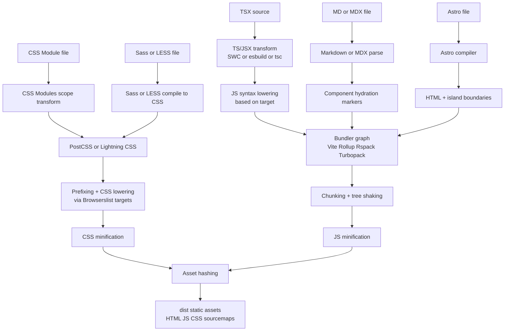

import { Aside } from '@astrojs/starlight/components'
import Disclaimer from '~/components/Disclaimer.astro'

## TL;DR

A modern frontend build usually does this:

1. Resolve dependencies.
2. Transpile or lower syntax.
3. Bundle modules.
4. Process CSS (including prefixing when needed).
5. Minify for production.
6. Emit optimized assets.

The tools changed (`webpack` era to `esbuild`/`SWC`/`OXC`/`Lightning CSS`), but the core steps stayed mostly the same.

## Quick Definitions

### Bundler

A bundler follows `import` graphs and combines modules into deployable files (often with code-splitting).

### Transpiler

A transpiler converts source code to another source form at similar abstraction level (for example TS/JSX -> JS).

### Minifier

A minifier removes unnecessary bytes while preserving behavior (whitespace removal, short identifiers, dead code elimination when safe).

### Uglifier

Historically, an uglifier is a JavaScript-focused minifier that aggressively rewrites code to be compact and less readable. In practice today, people often say "minifier" for both.

### Syntax lowering (downleveling)

Converting newer language syntax to older equivalents for compatibility (for example optional chaining -> guarded property access).

### CSS prefixes

Adding vendor-prefixed CSS properties when older browser engines still require them (like `-webkit-` forms).

## Before/After Examples by Tool Category

### 1) Bundler

**Before (multiple modules):**

```ts
// math.ts
export const sum = (a: number, b: number) => a + b
```

```ts
// main.ts
import { sum } from './math'
console.log(sum(2, 3))
```

**After (single production chunk, simplified):**

```js
(()=>{"use strict";console.log(2+3)})();
```

What happened: module graph resolution + tree-shaking + chunk emit.

### 2) Transpiler (TypeScript/JSX -> JavaScript)

**Before:**

```tsx
type Props = { name: string }

export function Hello({ name }: Props) {
  return <h1>Hello {name}</h1>
}
```

**After (JS, simplified):**

```js
export function Hello({ name }) {
  return React.createElement('h1', null, 'Hello ', name)
}
```

What happened: type erasure + JSX transform.

### 3) Minifier

**Before:**

```js
function formatUserName(firstName, lastName) {
  const full = `${firstName} ${lastName}`
  return full.trim()
}
```

**After:**

```js
function formatUserName(n,r){return`${n} ${r}`.trim()}
```

What happened: whitespace/comments removed and identifiers shortened.

### 4) Uglifier (legacy naming, JS-focused minification)

**Before:**

```js
if (isEnabled) {
  runTask()
}
```

**After:**

```js
isEnabled&&runTask();
```

What happened: compact expression rewriting.

### 5) Syntax lowering

**Before:**

```js
const city = user?.address?.city ?? 'Unknown'
```

**After (older-compatible pattern):**

```js
var _a, _b
const city = (_b = (_a = user == null ? void 0 : user.address) == null ? void 0 : _a.city) != null ? _b : 'Unknown'
```

What happened: optional chaining and nullish coalescing lowered.

### 6) CSS prefixes

**Before:**

```css
.card {
  user-select: none;
  backdrop-filter: blur(8px);
}
```

**After (depending on target browsers):**

```css
.card {
  -webkit-user-select: none;
  user-select: none;
  -webkit-backdrop-filter: blur(8px);
  backdrop-filter: blur(8px);
}
```

What happened: prefixed declarations added for targeted engines.

## Most Used Tools (Modern vs Older)

| Category | Modern/common choices | Older/legacy choices |
| --- | --- | --- |
| Bundler | Vite (Rollup today, Rolldown emerging), Rspack, Turbopack, esbuild, Bun bundler, Deno tasks/bundle workflows | Webpack 4/5-era heavy configs, Browserify, Parcel v1 |
| Transpiler | TypeScript compiler (`tsc`), SWC, esbuild, OXC transforms | Babel-only pipelines for most transforms |
| Minifier | esbuild minify, SWC minify, Terser, Lightning CSS (for CSS) | UglifyJS |
| Uglifier (term/tool) | Terser (spiritual successor), SWC/esbuild minify | UglifyJS / uglify-es |
| Syntax lowering | SWC, Babel preset-env, esbuild target, `tsc` downlevel emit | Handwritten compatibility transforms |
| CSS prefixes + CSS transforms | PostCSS + Autoprefixer, Lightning CSS, Browserslist-driven pipelines | Compass-era mixins, manual prefixing everywhere |

<Aside type="note">
  **Where do these named tools fit?**

  **webpack / Rollup / Rspack / Turbopack / Vite / esbuild:** mostly bundling + optimization orchestration.

  **TypeScript compiler, SWC, Babel, OXC:** mostly transpilation/lowering.

  **PostCSS / Autoprefixer / Lightning CSS:** mostly CSS transforms, prefixing, and minification.

  **Browserslist:** target definition used by several tools to decide what to lower or prefix.

  **Bun / Deno:** runtimes that also provide build workflows (bundling/transforms) in many setups.
</Aside>

## Side Note: Formatter vs Linter (Not Build Steps)

- **Formatters** (Prettier, Biome formatter, `oxformat`, Deno fmt): enforce code style.
- **Linters** (ESLint, Biome linter, Oxlint, Deno lint): catch suspicious patterns and quality issues.

They usually run in dev/CI, not as required runtime transforms for shipped bundles.

## End-to-End Build Path (TSX, CSS Modules, Sass/LESS, MD/MDX, Astro)



## Practical Heuristic

If your app targets modern browsers and has modest complexity, default to lighter pipelines (for example Vite + TypeScript + Lightning CSS/PostCSS with Browserslist). Add complexity only when a measurable requirement appears (legacy support, very large monorepo, strict performance budgets, special deployment constraints).

## References

- [Do we still need build tools?](https://olliewilliams.xyz/blog/no-build/)
- [Web dependencies are broken. Can we fix them?](https://lea.verou.me/blog/2026/web-deps/)
- [Vite Documentation](https://vite.dev/)
- [webpack Documentation](https://webpack.js.org/)
- [Rspack Documentation](https://rspack.dev/)
- [Turbopack Documentation](https://turbo.build/pack)
- [Rollup Documentation](https://rollupjs.org/)
- [esbuild Documentation](https://esbuild.github.io/)
- [Lightning CSS Documentation](https://lightningcss.dev/)
- [PostCSS Documentation](https://postcss.org/)
- [Autoprefixer Documentation](https://github.com/postcss/autoprefixer)
- [TypeScript Compiler Options](https://www.typescriptlang.org/tsconfig)
- [Browserslist](https://browsersl.ist/)

<Disclaimer />
