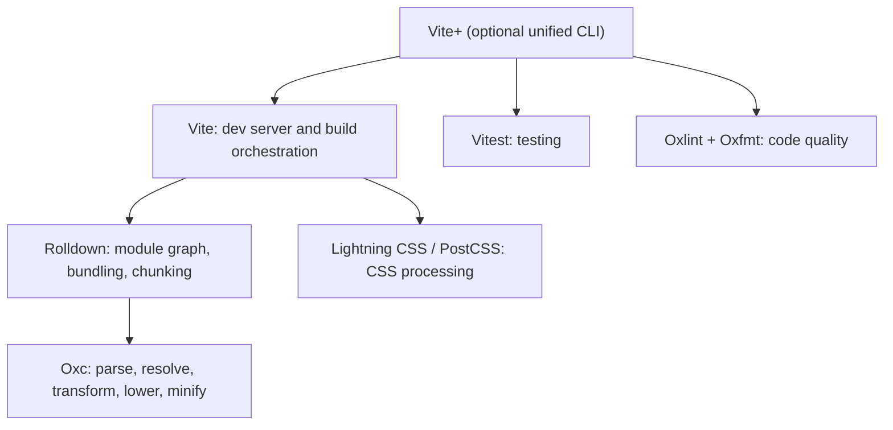
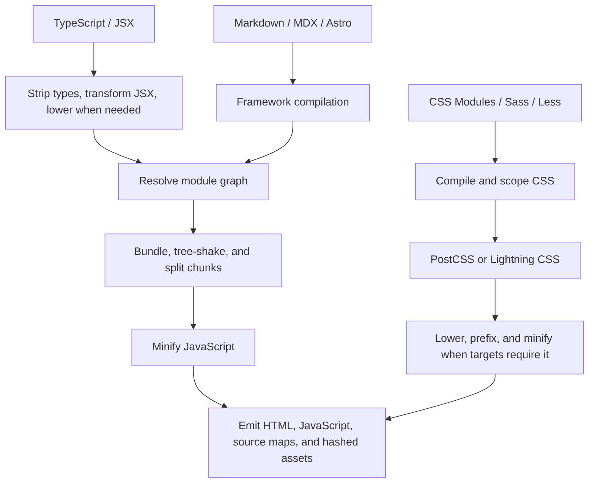

import { Aside } from '@astrojs/starlight/components'
import Disclaimer from '~/components/Disclaimer.astro'

## TL;DR

A build tool is usually a stack, not one indivisible program. Depending on the project, that stack may:

1. Resolve imports and assets.
2. Strip types and transform JSX.
3. Lower unsupported syntax.
4. Bundle modules into deployable chunks.
5. Process CSS and other assets.
6. Minify and emit production files.

Not every project needs every step. Modern browsers understand ES modules and much newer JavaScript and CSS than they used to, while TypeScript, JSX, dependency optimization, code-splitting, and framework compilation still make build tools useful.

The ecosystem is also converging. An established stack might combine webpack, Babel, Terser, and PostCSS. A modern Vite stack can combine Vite, Rolldown, Oxc, Lightning CSS, and Vitest behind a small number of commands.

## What Happens to Your Source

The exact output varies by tool, configuration, and browser target. The examples below are deliberately conceptual: each isolates one operation instead of pretending that a real production build performs only one optimization at a time.

### Resolve and bundle modules

A **resolver** turns an import such as `./math` or `react` into a specific file. A **bundler** follows those resolved imports, builds a module graph, and emits one or more deployable chunks.

**Before:**

```js
// math.js
export const sum = (a, b) => a + b

// main.js
import { sum } from './math.js'

console.log(sum(2, 3))
```

**After, simplified:**

```js
const sum = (a, b) => a + b

console.log(sum(2, 3))
```

The module boundary disappeared. A production build may then split the graph into multiple chunks, remove unused exports through tree-shaking, and minify the result—but those are separate decisions.

Representative tools include webpack, Rollup, Rolldown, esbuild, Rspack, Parcel, and Bun's bundler. Vite orchestrates this work and uses Rolldown as its bundler in Vite 8.

### Strip types and transform syntax

A **transformer**, sometimes called a transpiler, converts source code into another source form. Common examples are removing TypeScript syntax and turning JSX into JavaScript.

**Before:**

```tsx
type Props = { name: string }

export function Hello({ name }: Props) {
  return <h1>Hello {name}</h1>
}
```

**After, simplified:**

```js
export function Hello({ name }) {
  return jsx('h1', { children: ['Hello ', name] })
}
```

The type annotation was erased and JSX became function calls. Babel, SWC, esbuild, Oxc, and the TypeScript compiler can perform some or all of this work.

<Aside type="caution">
  Stripping TypeScript syntax is not the same as checking types. Fast
  transformers such as esbuild, SWC, and Oxc commonly erase types without
  performing the same semantic type checking as the TypeScript compiler. Many
  projects therefore transform and type-check in separate steps.
</Aside>

### Lower newer syntax

**Syntax lowering**, or downleveling, rewrites syntax that a target runtime does not understand.

**Before:**

```js
const city = user?.city
```

**After, conceptually:**

```js
const city = user == null ? undefined : user.city
```

The program keeps the optional access behavior without requiring the optional chaining syntax. Babel, SWC, esbuild, Oxc, and `tsc` can lower JavaScript according to a configured target. Exact output differs, and a modern browser target may need no rewrite at all.

Lowering syntax does not automatically provide missing runtime APIs. Supporting an older environment may also require polyfills for features such as newer built-in methods.

### Process CSS

CSS tooling can compile preprocessors, scope CSS Modules, rewrite newer CSS features, add vendor prefixes, and minify the result. These are related operations, but none is universally required.

**Before:**

```css
.card {
  user-select: none;
}
```

**After, for a target that needs the prefix:**

```css
.card {
  -webkit-user-select: none;
  user-select: none;
}
```

PostCSS is a plugin-based transformation platform; Autoprefixer is one of its plugins and uses Browserslist targets. Lightning CSS provides parsing, lowering, prefixing, and minification in an integrated implementation. Sass and Less first compile their own languages to CSS.

### Minify production output

A **minifier** reduces file size while preserving observable behavior. It may remove whitespace, shorten local identifiers, simplify expressions, and eliminate unreachable code.

**Before:**

```js
function formatUserName(firstName, lastName) {
  const fullName = `${firstName} ${lastName}`
  return fullName.trim()
}
```

**After:**

```js
function formatUserName(n, r) {
  return `${n} ${r}`.trim()
}
```

Terser, esbuild, SWC, and Oxc can minify JavaScript; Lightning CSS and cssnano are CSS choices.

“Uglifier” is mostly historical vocabulary rather than a separate build stage. UglifyJS popularized the name, while Terser became its widely used successor for modern JavaScript. Today, **minifier** is the clearer general term.

## The Ecosystem: Established and Newer Choices

“Modern” does not mean “the old tool is dead.” State of JavaScript 2025 respondents still reported slightly more experience with webpack than Vite, even as Vite led in satisfaction and newer native-speed tools gained interest. Mature projects often keep an established stack because its compatibility, plugins, and operational knowledge matter more than benchmark wins.

| Role                               | Established choices                   | Newer or high-performance choices    | Important distinction                                                                                   |
| ---------------------------------- | ------------------------------------- | ------------------------------------ | ------------------------------------------------------------------------------------------------------- |
| Build orchestration and dev server | webpack, Parcel                       | Vite                                 | Vite coordinates a development and production workflow; it is more than a bundler binary.               |
| Bundling                           | webpack, Rollup, Parcel               | Rolldown, Rspack, esbuild, Bun       | Turbopack is primarily encountered through Next.js rather than chosen as a general-purpose replacement. |
| TypeScript and JSX transforms      | TypeScript compiler, Babel            | SWC, esbuild, Oxc                    | Only some of these perform type checking.                                                               |
| JavaScript lowering                | Babel preset-env, TypeScript compiler | SWC, esbuild, Oxc                    | Targets determine whether a transform runs.                                                             |
| JavaScript minification            | Terser                                | esbuild, SWC, Oxc                    | UglifyJS and uglify-es are historical predecessors, not a separate category.                            |
| CSS transformation                 | PostCSS, Autoprefixer, Sass, Less     | Lightning CSS                        | Browserslist defines targets for compatible tools; it does not transform code itself.                   |
| Formatting                         | Prettier                              | Biome, Oxfmt                         | Formatting is a development check, not a production build stage.                                        |
| Linting                            | ESLint                                | Biome, Oxlint                        | Linters analyze source for likely bugs and policy violations.                                           |
| Testing                            | Jest                                  | Vitest, Node's test runner, Bun test | Testing belongs to the wider toolchain, not the emitted application.                                    |

## A Coherent Vite and Oxc Stack

The Vite ecosystem is appealing because its pieces form layers rather than a bag of unrelated commands:



Oxc itself is a suite built on shared compiler components:

- **Parser:** turns JavaScript or TypeScript text into an abstract syntax tree.
- **Resolver:** finds the file referenced by an import.
- **Transformer:** strips TypeScript, transforms JSX, and lowers newer JavaScript.
- **Minifier:** reduces production JavaScript.
- **Oxlint:** provides ESLint-oriented static analysis.
- **Oxfmt:** provides Prettier-oriented formatting.

Vitest supplies a Vite-native test runner, while Vite+ can place the wider workflow behind one CLI. You usually interact with the top of the stack; you do not install every internal component individually.

## All-in-One Tooling Suites

Some projects extend beyond the build pipeline and offer a complete development toolkit.

| Toolkit   | What it brings together                                                                                           | Main tradeoff                                                                                                                               |
| --------- | ----------------------------------------------------------------------------------------------------------------- | ------------------------------------------------------------------------------------------------------------------------------------------- |
| **Vite+** | Runtime and package-manager coordination, Vite, Vitest, Oxlint, Oxfmt, Rolldown, tsdown, and task running         | A consistent workflow with fewer top-level tools, in exchange for adopting a newer, curated abstraction that is currently in beta.          |
| **Bun**   | JavaScript runtime, package manager, bundler, test runner, and related APIs                                       | Fast and incrementally adoptable, but using the runtime itself can expose compatibility differences from Node.js.                           |
| **Deno**  | JavaScript runtime, dependency management, testing, formatting, linting, type checking, tasks, coverage, and more | Strong built-in conventions and a small tool surface, but adopting its runtime and workflow is a broader decision than replacing a bundler. |

These are not exact substitutes. Vite+ unifies a frontend workflow while continuing to work with the Node and npm ecosystem. Bun and Deno are runtimes as well as tooling suites, so choosing either can affect application behavior and deployment—not just developer commands.

The benefit of an all-in-one toolkit is coherence: fewer configuration files, dependency relationships, and version mismatches. The cost is coupling: specialized tools may expose more plugins, more granular upgrades, or a better escape hatch for unusual requirements.

## One Possible End-to-End Build

Here is an illustrative Vite/Astro-style build, not a universal sequence:



Changing the framework, target environments, or deployment platform changes this path. A small browser-native application may skip framework compilation and bundling entirely; a large application may add image optimization, server compilation, declaration generation, or separate client and server graphs.

## References

- [State of JavaScript 2025: Build Tools](https://2025.stateofjs.com/en-US/libraries/build-tools/)
- [Modern JavaScript Explained For Dinosaurs](https://peterxjang.com/blog/modern-javascript-explained-for-dinosaurs.html) — Peter Jang
- [Do we still need build tools?](https://olliewilliams.xyz/blog/no-build/) — Ollie Williams
- [Web dependencies are broken. Can we fix them?](https://lea.verou.me/blog/2026/web-deps/) — Lea Verou

<Disclaimer />
