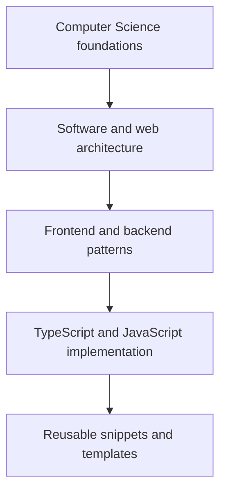

import { Aside, CardGrid, LinkCard } from '@astrojs/starlight/components'
import { LINKS } from '~/constants/links'

## TL;DR

Use a **tree for the main learning path**, **tags for cross-cutting themes**, and
**links for lateral jumps**.

- The tree answers: _What should I read before or after this?_
- Tags answer: _What other content touches the same topic?_
- Links answer: _Where should I zoom out or go deeper next?_

That keeps the navigation simple in Starlight without turning the site into a
full wiki.

## A Good Default Structure

For this repository, the cleanest structure is:

This means one article can belong to a **main depth level** while still being
discoverable through tags and related links.

## Suggested Reading Tree for This Repo

### 1. Broad Concepts

- <a href={`${LINKS.blog()}/17-programming-paradigms`}>Programming Paradigms</a>
- <a href={`${LINKS.blog()}/14-algorithm-strategies`}>Algorithm Strategies</a>
- <a href={`${LINKS.blog()}/21-data-structures`}>Data Structures</a>
- <a href={`${LINKS.blog()}/32-software-architecture-map`}>
    Software Architecture Map
  </a>

### 2. System and Web Architecture

- <a href={`${LINKS.blog()}/30-internet-layers`}>
    How the Internet Works, Layer by Layer
  </a>
- <a href={`${LINKS.blog()}/19-web-rendering-patterns`}>
    Web Rendering Patterns
  </a>
- <a href={`${LINKS.blog()}/24-webhooks`}>Webhooks</a>
- <a href={`${LINKS.blog()}/28-idempotency`}>Idempotency</a>
- <a href={`${LINKS.blog()}/13-acid`}>ACID</a>

### 3. Design and Application Patterns

- <a href={`${LINKS.blog()}/20-design-patterns`}>Design Patterns</a>
- <a href={`${LINKS.blog()}/27-observer-pattern`}>Observer Pattern</a>
- <a href={`${LINKS.blog()}/10-dry-principle`}>DRY Principle</a>
- <a href={`${LINKS.blog()}/11-solid-principles`}>SOLID Principles</a>

### 4. TypeScript Implementation Details

- <a href={`${LINKS.blog()}/01-types`}>TypeScript Types</a>
- <a href={`${LINKS.blog()}/02-generics`}>Generics</a>
- <a href={`${LINKS.blog()}/03-desctructuring`}>Destructuring</a>
- <a href={`${LINKS.blog()}/05-higher-order-functions`}>
    Higher-Order Functions
  </a>
- <a href={`${LINKS.blog()}/06-debouncing-throttling`}>
    Debouncing and Throttling
  </a>

### 5. Concrete Snippets

- <a href={LINKS.snippets('typescript/tree/find-node-in-tree')}>
    Find node in tree
  </a>
- <a href={LINKS.snippets('typescript/function/throttle-debounce')}>
    Throttle / debounce helper
  </a>
- <a href={LINKS.snippets('typescript/array/group-by')}>Group by</a>

## How to Use Tags

Tags already work well here, but they should stay **flat**.

Use them as facets, not as the tree itself:

- **Topic tags**: `Architecture`, `TypeScript`, `Database`, `Git`
- **Problem-space tags**: `Performance`, `Collaboration`, `Debugging`
- **Format or lens tags**: `Best Practices`, `Introduction`, `Comparison`

<Aside type="tip">
  A good rule is: use the tree for <strong>depth</strong>, and use tags for
  <strong>overlap</strong>.
</Aside>

Trying to encode parent/child relationships inside tags usually becomes hard to
maintain.

## How to Deal with Links

Each article should ideally link in three directions:

1. **Upward** to the broader concept it depends on
2. **Sideways** to sibling articles at the same level
3. **Downward** to a more concrete implementation or snippet

In practice, that gives a simple pattern:

- **Zoom out**: "If this topic feels too specific, read X first."
- **See also**: "If you already know this concept, compare it with Y."
- **Implement it**: "Here is the TypeScript version or snippet."

This repo already has a good supporting mechanism for the sideways links via the
related-posts section in the footer.

## Graph or Wiki?

- A **graph view** is useful as a visual index. Mermaid is enough for that here.
- A **wiki** is useful when every page is heavily interlinked and frequently
  edited.

For this Astro + Starlight site, the smallest sustainable solution is:

1. Keep the sidebar and directories simple
2. Add one or more hub pages like this map
3. Keep tags flat
4. Add contextual links inside articles

That gives most of the value of a wiki without the maintenance cost.

## Recommended Authoring Rule

When adding a new article, decide:

1. **Where does it sit in the main tree?**
2. **Which 2-5 flat tags describe it best?**
3. **Which broader article should it link back to?**
4. **Which more specific article or snippet should it point to next?**

<CardGrid>
  <LinkCard
    title="Browse the blog"
    href={LINKS.blog()}
    description="Read the articles that make up the high-level to low-level path."
  />
  <LinkCard
    title="Open the article template"
    href={LINKS.reference('templates/article-template')}
    description="Use the template when drafting a new article for this map"
  />
</CardGrid>
